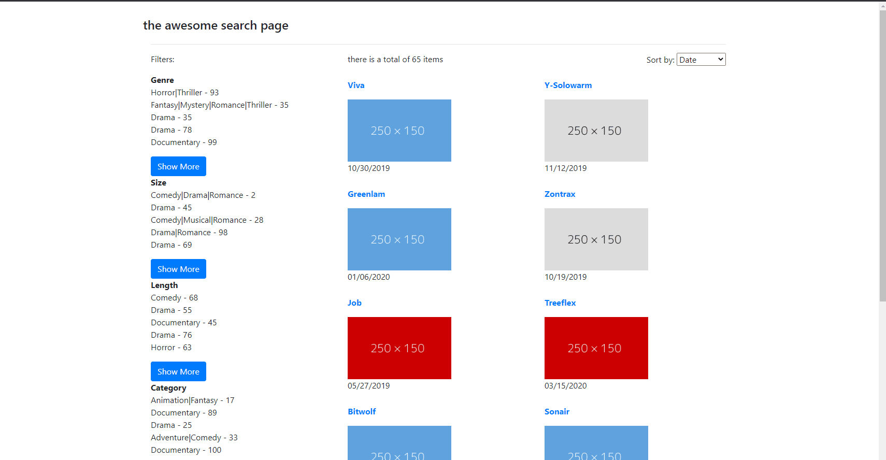

**vue-js-search-page**

A resuable set of components implementing a sample SPA with **Infinite-scrolling**, **faceted search** and list of active facets.

Made with **vueJS** and **Typescript**, powered by **Webpack** and **ESlint**.

Download the source code and run:

`$ npm install`

then

`$ npm run dev`

it uses **axios** to call API, but for this sample I put **axios-mock-adapter** to retrieve some mock data i generated using [Mockaroo](https://mockaroo.com/)